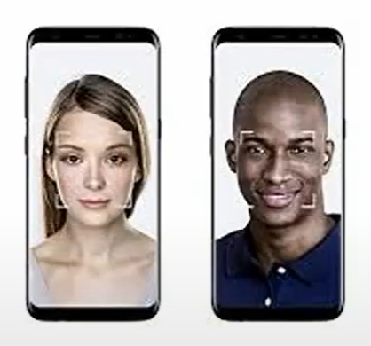
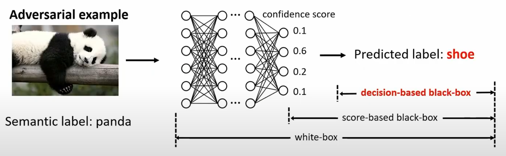
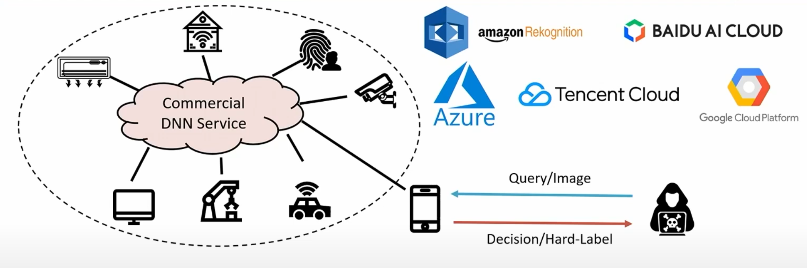
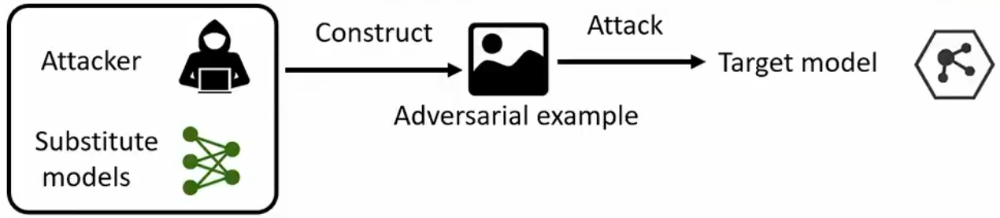
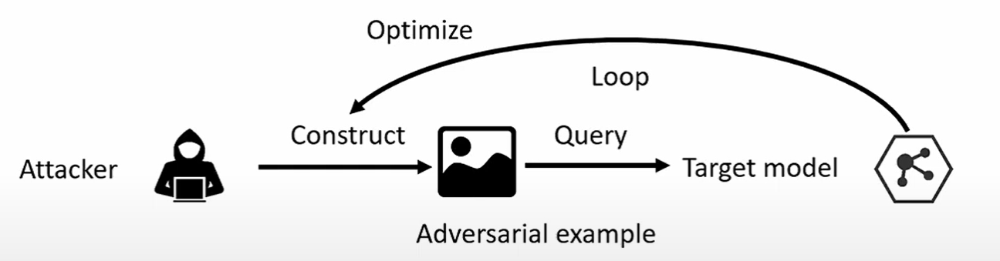
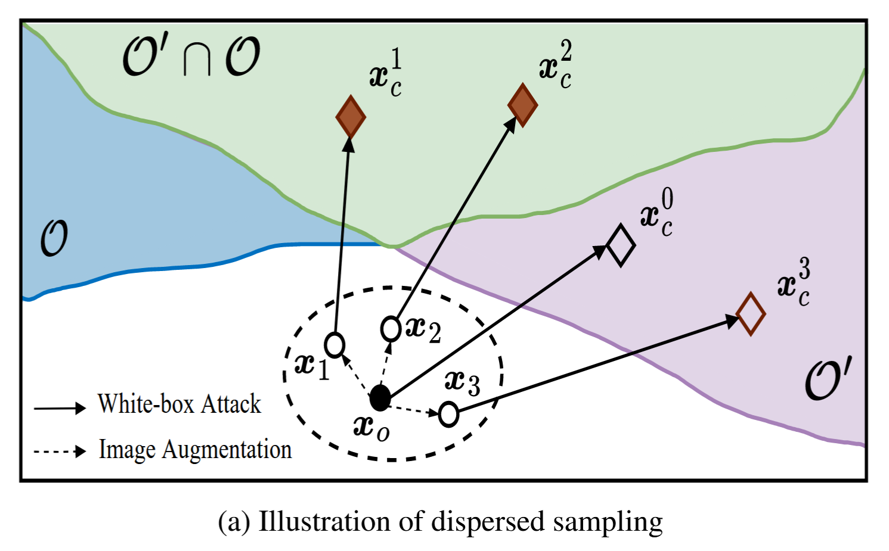
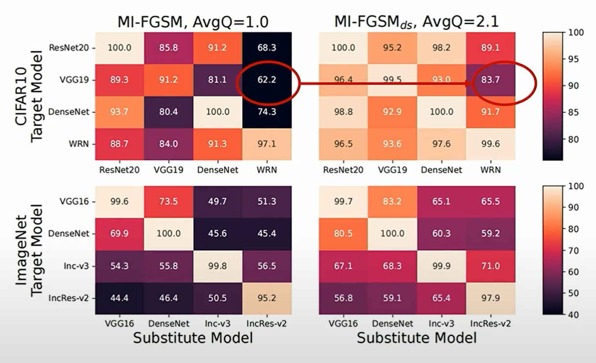
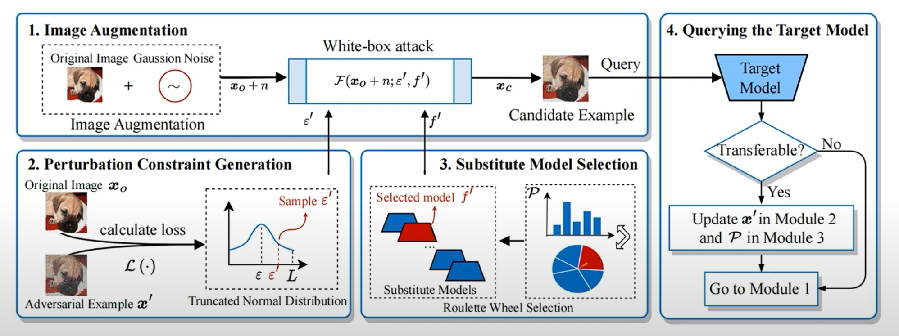

# Transferability of White-box Perturbations: Query-Efficient Adversarial Attacks against Commercial DNN Services

<small>Included in USENIX Security 24</small>

## Deep Neural Networks

Deep neural networks have been widely used to extract higher-level features from the raw data and provide users with explicitly desicions.

    

        
        
Face Recognition

    

    

        
        
Image Classification

    

    

        
        
Autonomous Driving

    

## Commercial DNN Services

Commercial DNN Services combine the computing power of the cloud with AI to offer business advantages, including quicker processing and cost savings.

 

Commercial DNN Services often access a large number of devices, and a successful attack against one of them exposes all to potential threats.

## Adversarial Attacks

Adversarial attacks add subtle perturbations to images to deceive the target model.

## Adversarial Attacks against Commercial DNN Services

- **Black box manner**: use APIs to query model and obtain hard-label outputs.
- **Strict query limits**: high costs and time consumption, more subceptible to defense.

## Existing Black-box Attacks

Various attacks have been proposed, which mainly fail into three categories: **transfer-based**, **query-based** and **hybrid**.

| Categories     | Method                                                                                          |
|----------------|-------------------------------------------------------------------------------------------------|
| Transfer-based | MI-FGSM[CVPR'18], DIM[CVPR'19], SINI-FGSM[ICLR'20], FIA[ICCV'21], NAA[CVPR'22]                  |
| Query-based    | BA[ICLR'18], HSJA[S&P'20], AHA[ICCV'21], SurFree[CVPR'21], RamBoAttack[NDSS'22]                 |
| Hybrid         | BiasedBA[ICCV'19], BAODS[NeurIPS'20], QEBA-I[CVPR'20], Prism[AISec'19], HybridAttack[USENIX'20] |

## Existing Black-box Attacks

### Transfer-based
Low success rate 

### Query-based
Large number of queries 

### Hybrid
Large number of queries, as substitute models cannot be fully exploited.

## Goal and Challenges

Goal: **Query-efficient** adversarial attacks against **commercial DNN services**.

Challenges:
- How to **exploit the transferability** of adversarial perturbations to boost black-box attacks?
- How to design an **effective and query-efficient** adversaial attack?

## Transferability of White-box Perturbations

### Adversarial region
Adversarial region $O$ denotes that the inside examples can deceive the model.

### Transfer-based attacks
Transfer-based attacks utilize substitute models to craft a candidate adversarial example, but this example often **fails to deceive** the model.

### Dispersed sampling
We aim to sample in the embedding space and craft **multiple examples**. It is more likely to find an example located in $O^\prime \cap O$.

## Transferability of White-box Perturbations (Cont'd)

    <h3>Justification</h3>
    By integrating the dispersed sampling technique, the MI-FGSM significantly improves the attack success rate by an average of 9.6% using only 2.1 average queries.
    

## Overview of DSA

4-step attack workflow to exploit the transferability of white-box perturbations.

## Module #1 Image Augmentation

### Varying the distribution or magnitude of perturbations enables different transferability.

- Carry out **image augmentation** (e.g. rotation, color jittering, and noise addition) on the original image.
- Image augmentation causes a **change** in the gradient of the neural network **backpropagation**, which changes the direction of perturbation optimization.
- White-box attacks typically perform the above optimization **multiple times**, **accumulating** such changes.

