

# Transferability of White-box Perturbations: Query-Efficient Adversarial Attacks against Commercial DNN Services

<small>Included in USENIX Security 24</small>

## Deep Neural Networks

Deep neural networks have been widely used to extract higher-level features from the raw data and provide users with explicitly desicions.

## Commercial DNN Services

Commercial DNN Services combine the computing power of the cloud with AI to offer business advantages, including quicker processing and cost savings.

    

Commercial DNN Services often access a large number of devices, and a successful attack against one of them exposes all to potential threats.

## Adversarial Attacks

Adversarial attacks add subtle perturbations to images to deceive the target model.

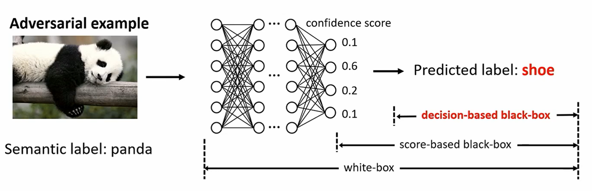

## Adversarial Attacks against Commercial DNN Services

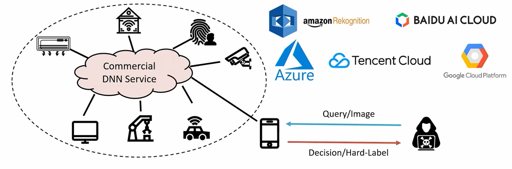

- **Black box manner**: use APIs to query model and obtain hard-label outputs.
- **Strict query limits**: high costs and time consumption, more subceptible to defense.

## Existing Black-box Attacks

Various attacks have been proposed, which mainly fail into three categories: **transfer-based**, **query-based** and **hybrid**.

| Categories     | Method                                                                                          |
|----------------|-------------------------------------------------------------------------------------------------|
| Transfer-based | MI-FGSM[CVPR'18], DIM[CVPR'19], SINI-FGSM[ICLR'20], FIA[ICCV'21], NAA[CVPR'22]                  |
| Query-based    | BA[ICLR'18], HSJA[S&P'20], AHA[ICCV'21], SurFree[CVPR'21], RamBoAttack[NDSS'22]                 |
| Hybrid         | BiasedBA[ICCV'19], BAODS[NeurIPS'20], QEBA-I[CVPR'20], Prism[AISec'19], HybridAttack[USENIX'20] |

## Drawback of existing Black-box Attacks

    

        <h3>Transfer-based</h3>
        
Low success rate

        <h3>Query-based</h3>
        
Large number of queries

        <h3>Hybrid</h3>
        
Large number of queries, as substitute models cannot be fully exploited.

    

    

        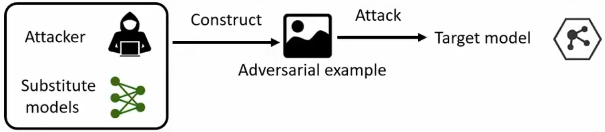
        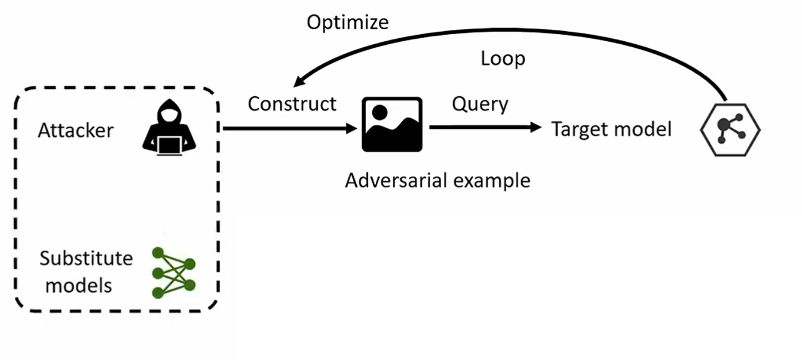
    

## Goal and Challenges

Goal: **Query-efficient** adversarial attacks against **commercial DNN services**.

Challenges:
- How to **exploit the transferability** of adversarial perturbations to boost black-box attacks?
- How to design an **effective and query-efficient** adversaial attack?

## Transferability of White-box Perturbations

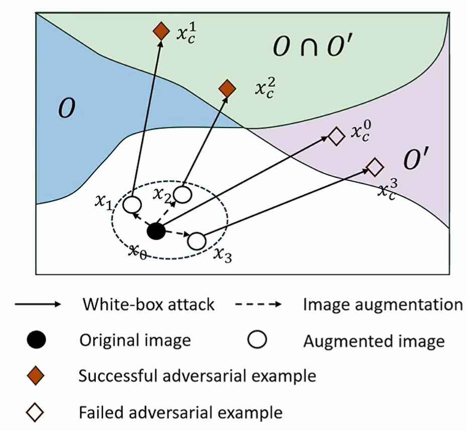

### Adversarial region
Adversarial region $O$ denotes that the inside examples can deceive the model.

### Transfer-based attacks
Transfer-based attacks utilize substitute models to craft a candidate adversarial example, but this example often **fails to deceive** the model.

### Dispersed sampling
We aim to sample in the embedding space and craft **multiple examples**. It is more likely to find an example located in $O^\prime \cap O$.

## Transferability of White-box Perturbations (Cont'd)

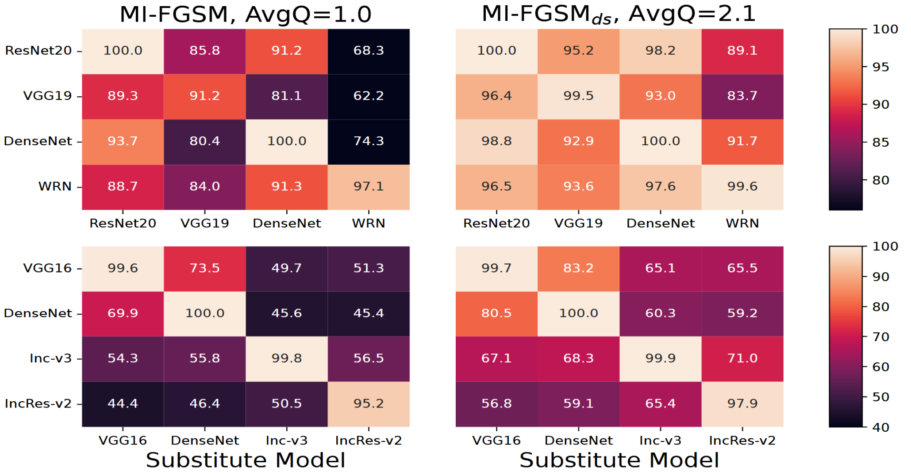

### Justification
By integrating the dispersed sampling technique, the MI-FGSM significantly improves the attack success rate by an average of **9.6%** using only **2.1** average queries.    

## Overview of DSA

4-step attack workflow to exploit the transferability of white-box perturbations.

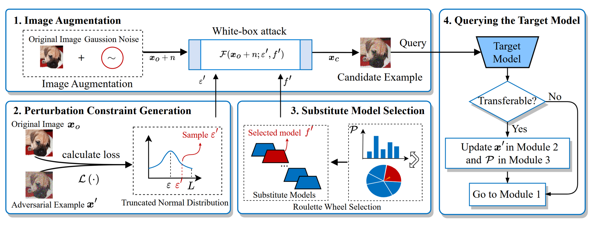

## Module #1 Image Augmentation

### Varying the distribution or magnitude of perturbations enables different transferability.

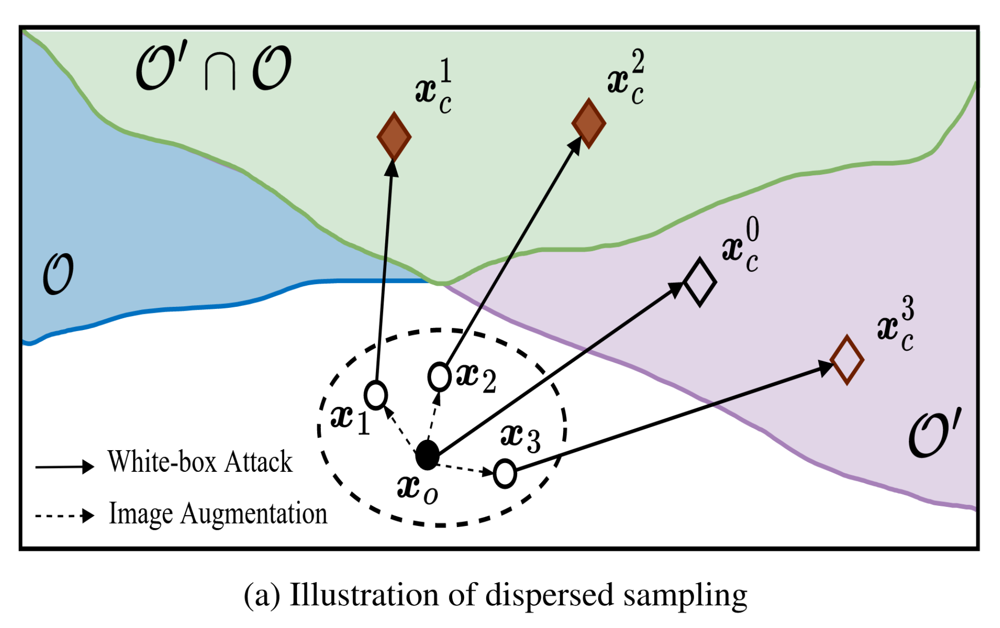

- Carry out **image augmentation** (e.g. rotation, color jittering, and noise addition) on the original image.
- Image augmentation causes a **change** in the gradient of the neural network **backpropagation**, which changes the direction of perturbation optimization.
- White-box attacks typically perform the above optimization **multiple times**, **accumulating** such changes.

## Module #2 Perturbation Constraint Generation

### Dynamically establish constraints for each white-box perturbation through a sampling process

    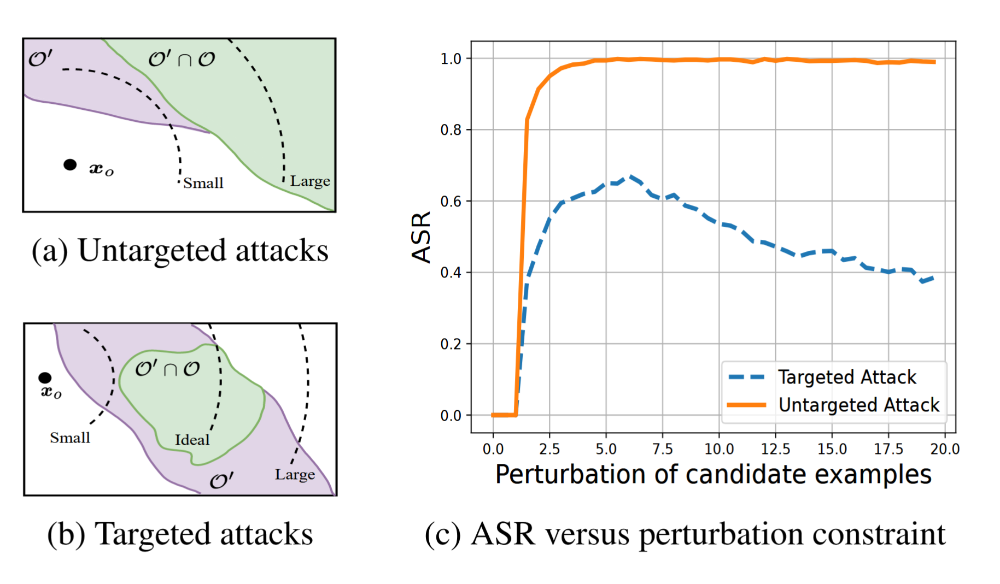
    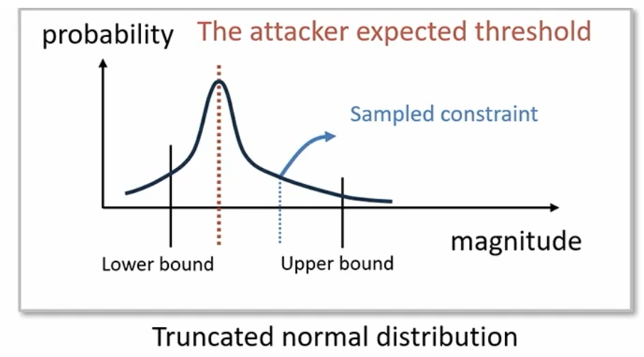

- Based on a **truncated normal distribution**
- **Gradually decrease** the upper bound

## Module #3 Substitute Model Selection

### Generate the candidate adversarial example in the union of adversarial regions of all substitute models

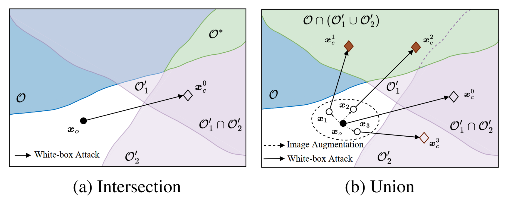

- An effective adversarial example can **easily fall in the union** of the adversarial region
- **One substitute model** is selected to generate a candidate adversarial example
- Use **Rosette Wheel Selection** to choose one model with the knowledge of the historical queries

## Module #4 Querying the Target Model

### Update the parameters based on the attack results to limit the sampling region

    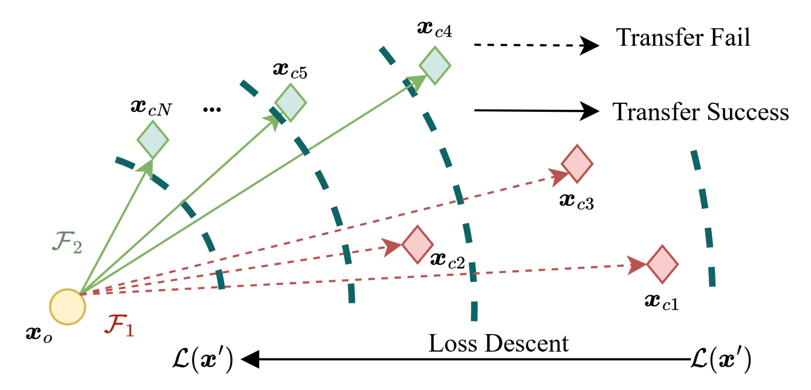

- Update the upper bound
- Update the probability of substitute model selection

## Experiment Setup

### Dataset and Model
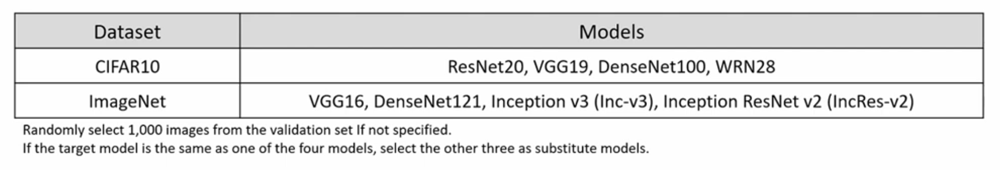

### Evaluation Metrics
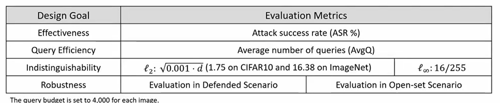

## Closed-set Evaluation

Evaluation on ImageNet, where the target and substitute models are trained on the same dataset.

    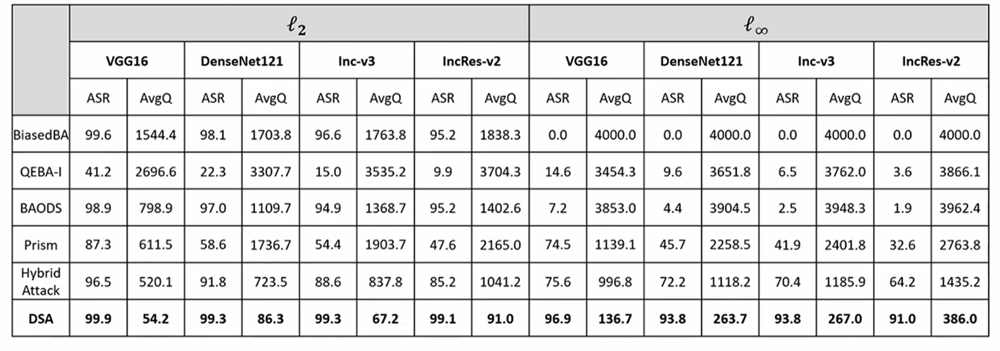

DSA achieves the **highest attack success rate** and **lowest average number of queries**.

## Closed-set Evaluation

Evaluation on ImageNet, where the target and substitute models are trained on the same dataset.

    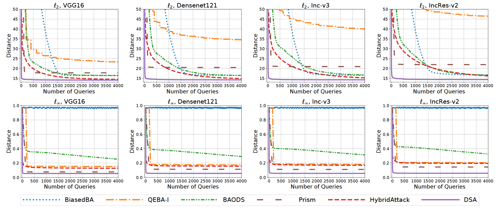

DSA always achieves the **lowest distance under all test cases** under the same number of queries.

## Closed-set Evaluation

Evaluate attack performance against ResNet50 integrated with 6 defenses on CIFAR-10.

    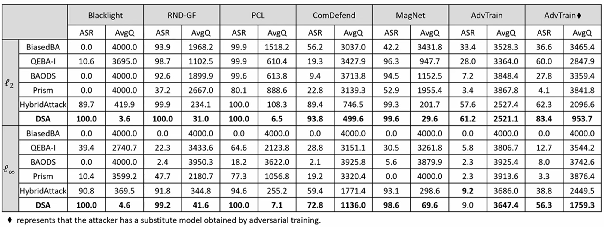

DSA is **robust in attacking the defended target models** and achieves the highest ASR with the lowest AvgQ in most tests.

## Open-set Evaluation
Assemble two mutually exclusive datasets for training the substitute and target models.

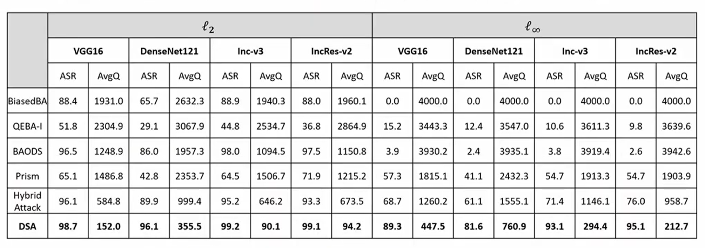

DSA **maintains high effectiveness and query-efficiency** in the open-set scenario.

## Evaluation on Commercial APIs

Carry out attacks on four well-known commercial DNN services: AWS, Azure, Baidu and Tencent.

<small>
Randomly select 20 images from ImageNet and set the query budget to 1,000.
</small>

    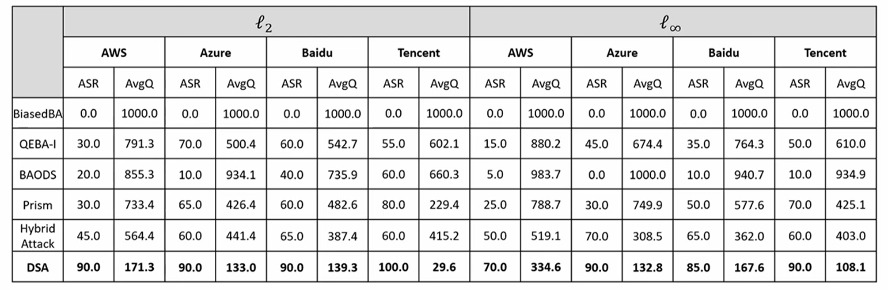

DSA can achieve **about 90% ASR within 200 queries** across four commercial APIs.

## Evaluation on Commercial APIs: Case Study
Illustration of adversarial examples on commercial APIs.

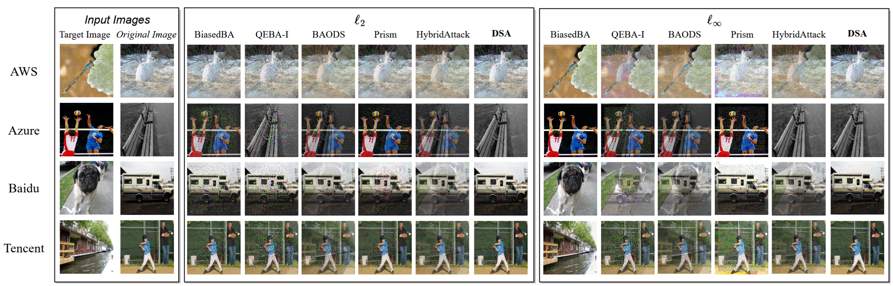

Adversarial examples generated by DSA are mostly approximate to the original images.

## Conclusion

### Contributions
- Propose that **varying the distribution or magnitude of perturbations enables different transferability**
- Propose **an effective and query-efficient adversarial attack** called DSA
- Conduct **comprehensive experiments** to demonstrate the superiority of DSA

### Future Work
- Improve the effectiveness of the attack under $\mathcal l_\infty$ and other norms
- Develop a lightweight and flexible defense to adapt to evolving attack strategies

## Thank you!

Presenter: Li Zhengao (李政翱)